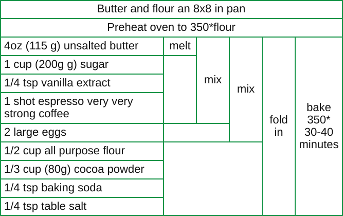

# recipevize

Turn terse, dependency-aware recipes into compact visual cooking maps.

[Inspired by this recipe visualization.](https://x.com/juanbuis/status/2082162851553398821)

## Example

[Try it out!](https://hherman1.github.io/recipeviz/)

```recipe
Butter and flour an 8x8 in pan
Preheat oven to 350*flour
UBR: 4oz (115 g) unsalted butter
melt UBR
SG: 1 cup (200g g) sugar
V: 1/4 tsp vanilla extract
COFFEE: 1 shot espresso very very strong coffee
MIX1: mix UBR SG V COFFEE
EGG: 2 large eggs
MIX2: mix MIX1 EGG
FLW: 1/2 cup all purpose flour
COCOA: 1/3 cup (80g) cocoa powder
BSO: 1/4 tsp baking soda
SALT: 1/4 tsp table salt
FOLD: fold in MIX2 FLW COCOA BSO SALT
bake 350* 30-40 minutes FOLD
```

Read it left to right: standalone instructions span the full width, ingredient
rows begin on the left, and each action block spans the rows it consumes as the
recipe converges toward the final step on the right.



## Usage

Install the CLI:

```sh
go install github.com/hherman1/recipeviz@latest
```

Pass it one `.recipe` file. The SVG is written to standard output:

```sh
recipeviz sample.recipe > sample.svg
```

Parse and validation errors are written to standard error and produce a
nonzero exit status. From a source checkout, the equivalent command is
`go run . sample.recipe > sample.svg`.

### Markdown

Pass `-html` to render a Markdown file as HTML. Each fenced `recipe` block
remains visible and gets a generated dependency SVG immediately above it:

````markdown
# My recipe

Got this from xyz.com

```recipe
BUTTER: 4 oz butter
melt BUTTER
```

I love it!
````

```sh
recipeviz -html recipe.md > recipe.html
```

### programmatic

The [`recipe`](./recipe) package exposes the AST, dependency forest, parser,
transformer, and SVG renderer:

```go
import "github.com/hherman1/recipeviz/recipe"

ast, err := recipe.Parse(source)
if err != nil {
	return err
}
forest, err := recipe.Transform(ast)
if err != nil {
	return err
}
svg := recipe.Render(forest)
```

## Spec

A `.recipe` file is plain text. Its approximate grammar is:

```text
recipe = step { newline step }
step   = [result ": "] description [" " input {" " input}]
result = ASCII letter or digit {ASCII letter or digit}
input  = a declared result
```

The declared result names in the file resolve the otherwise ambiguous boundary
between a description and its trailing inputs.

### Steps

- Every nonblank line is one step. Blank lines are ignored.
- Leading and trailing whitespace is removed. Runs of whitespace within a step
  are normalized to one space.
- Every step must retain a nonempty description after its result declaration
  and inputs are removed.
- There is no comment syntax; a nonblank line beginning with `#` is a step.

### Results

- A step declares a result by beginning with an ASCII alphanumeric name,
  followed by `: ` (a colon and at least one space): `NAME: description`.
- Names are case-sensitive. `MIX1` and `mix1` are different results.
- Names must be unique within the file. Duplicate declarations are invalid.
- A declaration does not need to precede its references; the entire file is
  scanned for declarations before inputs are resolved.
- A step without a declaration is unnamed.

### Inputs

- Inputs are the longest sequence of whitespace-separated, declared result
  names at the end of a step.
- Inputs must be complete tokens. In `use MIX1`, `MIX1` is an input; in
  `use MIX1.`, it is description text.
- Only names declared somewhere in the file are recognized as inputs.
  Undeclared trailing words remain part of the description.
- Input order in the source does not control vertical layout. Independent
  inputs are displayed in the order their producing steps first appear.

For example:

```recipe
ONION: one onion
OIL: 1 tbsp oil
MIX: saute ONION OIL
```

`MIX` has the description `saute` and incorporates `ONION` and `OIL`.

### Forest rules

The resolved steps must form a forest:

- A result may be incorporated by at most one other step. Branching a result
  into two consumers is invalid.
- Dependency cycles are invalid.
- A named step with no inputs is a leaf.
- A result that is never incorporated is a root.
- An unnamed step with no inputs is an independent root.
- An unnamed step with one input carries that input's name forward. After
  `melt BUTTER`, a later reference to `BUTTER` means the result of `melt`.
- An unnamed step with multiple inputs consumes them as a final root; its
  result cannot be referenced because it has no name.

Dependencies are always placed before the steps that consume them. Otherwise,
trees and sibling subtrees preserve the order in which their earliest steps
appear in the file.
